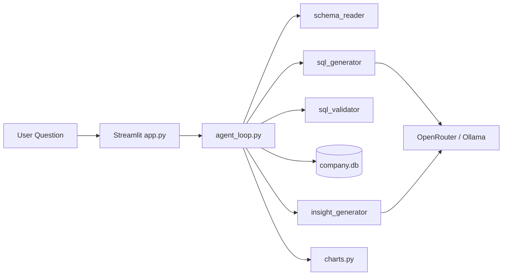

# InsightSQL — NL-to-SQL Analytics Agent

> **Hackathon submission** · Natural language analytics over SQLite with a 7-step AI agent pipeline.

Ask business questions in plain English. The agent reads your schema, generates **safe read-only SQL**, executes it, returns **Rs-denominated** results, charts, and business insights.


---

## Problem

Business teams wait on data engineers for ad-hoc SQL. **InsightSQL** lets anyone query a company warehouse in natural language with full transparency (SQL shown, results downloadable).

## Solution

| Step | Action |
|------|--------|
| 1 | Read SQLite schema automatically |
| 2 | Understand the user's question |
| 3 | Generate SQL (OpenRouter or Ollama Llama3) |
| 4 | Validate SQL (SELECT-only security) |
| 5 | Execute against read-only SQLite |
| 6 | Analyze results → business insight |
| 7 | Recommend & render Plotly chart |

## Demo data

Indian company dataset with **Tamil employee names** (Dhana, Priya, Rithan, Yoga, Gopi, Jaya, Dharshana, Gayu, Loki, Koushi, Dharshini, …) and **Rs** pricing across Tamil Nadu locations (Chennai, Coimbatore, Madurai, Trichy, Salem, Hosur).

**Tables:** `departments` · `employees` · `products` · `sales`

## Features (hackathon-ready)

- Polished Streamlit UI with KPI cards and agent timeline
- **Query history** with timestamps + export full log as CSV
- **Download any result** as CSV
- **10 sample questions** one-click in sidebar
- Loading status animation during agent run
- Friendly error messages + troubleshooting tips
- OpenRouter (cloud) or Ollama (local) backends
- 20+ automated tests

## Architecture



## Project structure

```
Infinite/
├── app.py                      # Streamlit entry point
├── config/constants.py         # Sample questions, Rs label
├── database/
│   ├── company.db
│   └── csv/                    # Seed data (Tamil names, Rs)
├── agents/
│   ├── agent_loop.py           # 7-step orchestration
│   ├── schema_reader.py
│   ├── sql_generator.py
│   ├── sql_validator.py
│   ├── insight_generator.py
│   └── llm_client.py
├── prompts/
│   ├── sql_prompt.txt
│   └── insight_prompt.txt
├── ui/
│   ├── styles.py
│   └── components.py
├── utils/
│   ├── database.py
│   ├── charts.py
│   ├── formatting.py           # Rs formatting
│   └── history.py              # Query log
├── tests/
│   ├── test_queries.py
│   ├── test_formatting.py
│   └── test_llm_client.py
├── requirements.txt
├── README.md
└── AI_USAGE.md
```

## Quick start

### 1. Clone & install

```bash
cd Infinite
python -m venv .venv
.venv\Scripts\activate          # Windows
pip install -r requirements.txt
```

### 2. AI backend (pick one)

**Option A — OpenRouter (recommended for demos)**

1. Get a key: https://openrouter.ai/keys  
2. Paste in sidebar or:

```bash
set OPENROUTER_API_KEY=sk-or-v1-...
```

**Option B — Ollama (local, free)**

```bash
ollama pull llama3
ollama serve
```

### 3. Run

```bash
streamlit run app.py
```

Open **http://localhost:8501**

## Sample questions

- Show total sales by month
- Which product has the highest sales?
- Show employee count by department
- List all employees named Priya or Dhana
- Top 5 employees by total sales amount

## Security

- Only `SELECT` / `WITH` queries allowed
- Blocks `DROP`, `DELETE`, `UPDATE`, `INSERT`, `ALTER`, `TRUNCATE`
- Read-only SQLite connection for execution
- No multi-statement SQL

## Tests

```bash
python -m pytest tests/ -v
```

## Environment variables

| Variable | Default | Description |
|----------|---------|-------------|
| `OPENROUTER_API_KEY` | — | OpenRouter key |
| `OPENROUTER_MODEL` | `google/gemini-2.5-flash` | Cloud model |
| `OLLAMA_HOST` | `http://localhost:11434` | Ollama URL |
| `OLLAMA_MODEL` | `llama3` | Local model |

## Team / hackathon notes

- **Currency:** All amounts displayed as **Rs** (Indian Rupees)
- **Names:** Demo employees use Tamil names for regional relevance
- **Reproducibility:** CSV seeds + `Rebuild DB` button in sidebar
- **AI transparency:** Generated SQL always shown; query history exportable

## License

MIT — built for educational and hackathon demonstration purposes.
